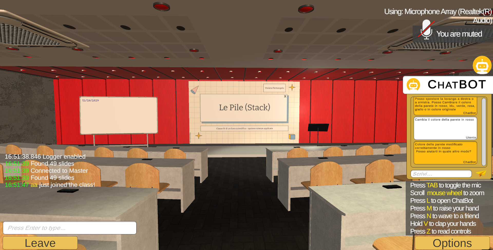

# LLM-Based Agent per l'adattamento dinamico dell'ambiente virtuale sulla base degli input inseriti dall'utente
Questo progetto, sviluppato come parte della mia tesi triennale, consiste in un'applicazione Unity che integra un chatbot per la personalizzazione di un ambiente virtuale (Virtual Environment) chiamato SENEM.
L'ambiente rappresenta una classe scolastica, e l'utente può interagire con il chatbot per modificarne elementi specifici.
Il chatbot realiazzato mediante l'utilizzo di un modello LLM pre-addestrato (Flan-t5-base), preleva le parole chiave nell'input dell'utente e le utilizza per capire quale modifica effuettuare sull'ambiente virtuale.

